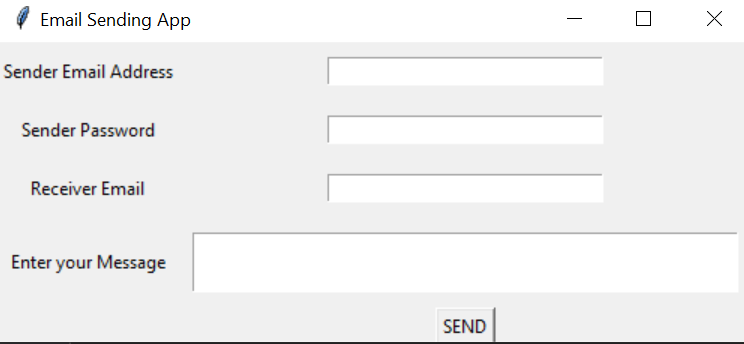

# Email-GUI

- Built a GUI which can send a Email .
- Currently supports only Gmail credentials.
- Senders Gmail must have " Less secure Apps" option ON otherwise there will be a authentivation error.
- Code is written in Python with tkinter , yagmail and Sys Modules.

